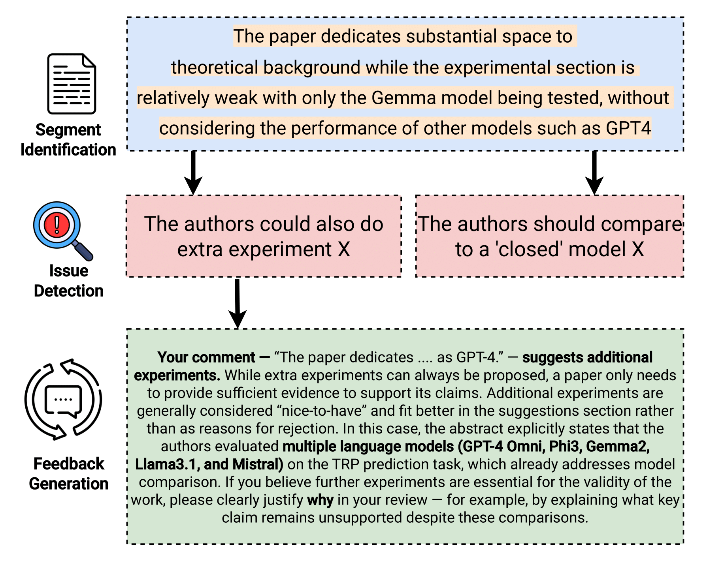

# Reviewing the Reviewer: Elevating Peer Review Quality through LLM-Guided Feedback

[](https://www.arxiv.org/abs/2508.05283)
[](https://opensource.org/licenses/Apache-2.0)
[](https://www.python.org/)
>  **Abstract**
>
> Peer review is central to scientific quality, yet reliance on simple heuristics—\textit{lazy thinking}—has lowered standards. Prior work treats lazy thinking detection as a single-label task, but review segments may exhibit multiple issues, including broader clarity problems, or \textit{specificity} issues. Turning detection into actionable improvements requires guideline-aware feedback, which is currently missing. We introduce an LLM-driven framework that decomposes reviews into argumentative segments, identifies issues via a neurosymbolic module combining LLM features with traditional classifiers, and generates targeted feedback using issue-specific templates refined by a genetic algorithm. Experiments show our method outperforms zero-shot LLM baselines and improves review quality by up to 92.4\%. We also release **LazyReviewPlus**, a dataset of 1,309 sentences labeled for *lazy thinking* and *specificity*.
>
This repository contains the code to reproduce the experiments in our paper, **"Reviewing the Reviewer: Elevating Peer Review Quality through LLM-Guided Feedback"**. 

<p align="center">

</p>


Contact person: [Sukannya Purkayastha](mailto:sukannya.purkayastha@tu-darmstadt.de)

[UKP Lab](https://www.ukp.tu-darmstadt.de/) | [TU Darmstadt](https://www.tu-darmstadt.de/
)

Don't hesitate to send us an e-mail or report an issue, if something is broken (and it shouldn't be) or if you have further questions.

> This repository contains experimental software and is published for the sole purpose of giving additional background details on the respective publication.


## Setup and WorkFlow
For running the experiments, one needs to install necessary packages that we provide in the ``requirements.txt`` file as below:
>
```bash
$ conda create -n reviewing_reviewer python=3.10
$ conda activate reviewing_reviewer
$ pip install -r requirements.txt
```
>
### Data
The dataset, LazyReviewPlus is available in the folder ```LazyReviewPlus``` in this repository. The templates created by us for each of the issues is provided in the same folder named ```template_knowledge.json```.


### Experiments
Our method comprises of three stages of processing: *Segment Detection of Reviews*, *Issue Detection* and *Feedback Generation*.


### Segment Identification of Reviews
We first segment a review into argumentative units using zero-shot prompting LLMs. Each sentence of the review is input to the LLM and it needs to output B (begin), I (inside) and O (outside / other) tags.

#### Sequential segmentation
The setup where prior predictions of the LLM is input to the model to make the current prediction.

> python src/segmentation/sequential.py \
    --data_path ARR2022.tsv \
    --model 'microsoft/phi-4' \
    --output_path path/to/output_file.tsv

- **`--data_path`**: Path to the input file. Note that although the help message says CSV, the code uses `sep='\t'`, so it expects a TSV file containing columns like `Review`, `Sentence`, `Section`, etc.
- **`--model`**: The HuggingFace model ID (e.g., `microsoft/phi-4`) or a local path to the model weights.
- **`--output_path`**: The file path where the resulting predictions and classification metrics will be saved.

#### Standalone segmentation
 This is the setup where the model independently tags the sentences with B, I or O without looking at the prior predictions.

> python src/segmentation/standalone.py \
    --data_path ARR2022.tsv \
    --model 'microsoft/phi-4' \
    --output_path path/to/output_file.tsv

All the arguments are same as in sequential segmentation.

### Issue Detection
The issue detection stage consists of three steps: extracting abstract features from review segments, generating feature vectors, and training ML classifiers to identify issues.

#### Abstract Feature Extraction

Extract abstract, high-level features (as Yes/No questions) that determine whether a review segment reflects a specific issue using an LLM.

```bash
python src/issue_detection/Abstract_feature_extraction.py \
    --data_file path/to/review_data.tsv \
    --llm_name "microsoft/phi-4"
```

- **`--data_file`**: Path to the TSV file containing review data. Must include columns `Review Segment` and `Combined Issue Types`.
- **`--llm_name`**: The HuggingFace model ID (e.g., `microsoft/phi-4`) or local path to the model weights.

Output: A pickle file named `abstract_features_{safe_llm_name}.pkl` containing extracted features for each issue type. A issue_to_segment pkl file that map each issue to the review segments.

#### Feature Vector Generation

Generate feature vectors for review segments by evaluating them against the extracted abstract features using an LLM.

```bash
python src/issue_detection/Feature_vector_generation.py \
    --data_file path/to/review_data.tsv \
    --feature_questions_file path/to/abstract_features_{llm_name}.pkl \
    --llm_name "microsoft/phi-4"
```

- **`--data_file`**: Path to the TSV file containing review data. Must include column `Review Segment`.
- **`--feature_questions_file`**: Path to the pickle file containing abstract features (output from Abstract_feature_extraction.py).
- **`--llm_name`**: The HuggingFace model ID (e.g., `microsoft/phi-4`) or local path to the model weights.

Output: A TSV file named `full-{safe_llm_name}-advanced_features.tsv` containing the original data with an additional `feature_vectors` column.

#### ML Model Classification

Train and evaluate ML classifiers for multi-label issue classification using the generated feature vectors.

```bash
python src/issue_detection/ML_model_classification.py \
    --data_file path/to/review_data.tsv \
    --feature_vectors_file path/to/full-{llm_name}-advanced_features.tsv \
    --issue_to_segments_file path/to/abstract_features_{llm_name}.pkl \
    --llm_name "microsoft/phi-4"
```

- **`--data_file`**: Path to the TSV file containing review data with issue labels. Must include columns `Review Segment`, `Combined Issue Types`, and `ID`.
- **`--feature_vectors_file`**: Path to the TSV file containing feature vectors (output from Feature_vector_generation.py).
- **`--issue_to_segments_file`**: Path to the pickle file containing abstract features (output from Abstract_feature_extraction.py).
- **`--llm_name`**: The HuggingFace model ID (e.g., `microsoft/phi-4`) or local path to the model weights used for feature generation.

The script performs the following:
- Extracts and decompose the features of issue types
- Stratified group-aware train-test split
- Cross-validation with multiple classifiers (Logistic Regression, Random Forest, SVM, Neural Networks, etc.)
- Evaluation using F0.5 score, precision, and recall metrics
- Output: `cv_results.csv` containing cross-validation results for all models


### Feedback Generation

#### Genetic Algorithm
The code to run the proposed genetic algorithm-based feedback generation method is as follows:
```bash
python src/feedback_generation/genetic_algo.py \
    --llm_model "microsoft/phi-4" \
    --review_segment "The paper dedicates substantial space to
theoretical background while the experimental section is
relatively weak with only the Gemma model being tested, without
considering the performance of other models such as GPT4" \
    --issue '''The authors should compare
to a 'closed' model X''' \
  --template "The reviewer should explicitly mention which baselines are missing and why they are important for validating the claims." \
  --n_candidates 10 \
  --n_generations 3 \
  --n_parents 5
```
- **`--llm_model`**: The HuggingFace model ID (e.g., `microsoft/phi-4`) or local path to the model weights.
- **`--review_segment`**: The specific text from a peer review that contains the issue.
- **`--issue`**: The label of the identified issue.
- **`--summary`**: (Optional) A summary of the paper being reviewed.
- **`--strengths`**: (Optional) Noted strengths of the paper.
- **`--template`**: The feedback template or guideline corresponding to the identified issue.
- **`--n_candidates`**: Number of initial feedback candidates to generate.
- **`--n_generations`**: Number of evolutionary generations to run.
- **`--n_parents`**: Number of parents selected for crossover in each generation.

#### Baselines
All the baselines used in our paper can be run with the following commands.

```bash
python src/feedback_generation/baselines.py \
  --llm_model "microsoft/phi-4" \
  --review_segment "The paper dedicates substantial space to
theoretical background while the experimental section is
relatively weak with only the Gemma model being tested, without
considering the performance of other models such as GPT4" \
  --issue '''The authors should compare
to a 'closed' model X''' \
--template "The reviewer should explicitly mention which baselines are missing and why they are important for validating the claims." \
--baseline "all" \
--n 5 \
--n_gen 3 
```
- **`--llm_model`**: The HuggingFace model ID (e.g., `microsoft/phi-4`, `meta-llama/Llama-2-7b-chat-hf`) or local path to the model weights.
- **`--review_segment`**: The specific text from a peer review that contains the issue.
- **`--issue`**: The label of the identified issue (e.g., `missing_comparison`).
- **`--template`**: The feedback template or guideline corresponding to the identified issue.
- **`--baseline`**: Specifies which baseline strategy to execute (`1-pass`, `Temp`, `Plan`, `BoN`, `Self-Ref.`, or `all`).
- **`--n`**: The number of candidates to generate (used specifically for `BoN` and `Self-Ref.` baselines).
- **`--n_gen`**: The number of generations or refinement steps (used for `BoN` and `Self-Ref.`).

#### Evaluation

```bash
python src/feedback_generation/prometheus_eval/eval.py \
    --input_path path/to/input_file.tsv \
    --output_path path/to/output_file \
    --model_name "prometheus-eval/prometheus-7b-v2.0" \
    --prompt_type "genetic_algo" \
    --max_new_tokens 512 \
    --batch_size 16
```
- **`--input_path`**: Path to the input TSV file containing generated feedback. Must contain `Review Segment` and `outputs` columns. `outputs` is the generated feedback.
- **`--output_path`**: Path prefix for the output CSV file where evaluation scores will be saved.
- **`--model_name`**: The HuggingFace model ID for the evaluator model (e.g., `prometheus-eval/prometheus-7b-v2.0`).
- **`--prompt_type`**: A label for the type of prompt or method being evaluated (e.g., `genetic_algo`, `baseline`).
- **`--max_new_tokens`**: Maximum number of tokens to generate for the evaluation (default: 512).
- **`--batch_size`**: Batch size for inference (default: 16).

## Models
The models used in our paper are:
In our paper, we performed experiments with the following models:

| Name                     | Sizes | 🤗 Model Links |
| :---:                     | :---: | :---: |
| Qwen 2.5 7B Instruct     | 7B    | [Qwen-2.5-7B-Instruct](https://huggingface.co/Qwen/Qwen2.5-7B-Instruct) |
| Yi 1.5 9B Chat           | 9B    | [Yi-1.5-9B-Chat](https://huggingface.co/01-ai/Yi-1.5-9B-Chat) |
| Deepseek LLM 7B Chat     | 7B    | [Deepseek-7B-Chat](https://huggingface.co/deepseek-ai/deepseek-llm-7b-chat) |
| Phi-4 14B                 | 14B   | [Phi-4-14B](https://huggingface.co/microsoft/phi-4) |
| GPT OSS 20B               | 20B   | [GPT-OSS-20B](https://huggingface.co/openai/GPT-OSS-20B) |

The Prometheus models we experimented with are: https://huggingface.co/prometheus-eval/prometheus-7b-v2.0


## Citation

```bib
@misc{
  
}
```


